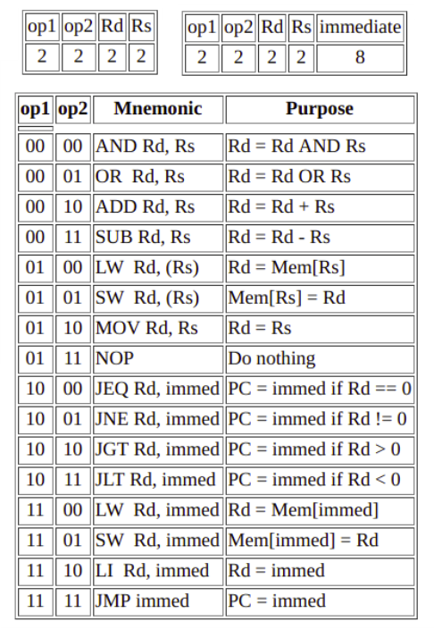

## 8-Bit arquitetura CPU Von Neumann 

### Functionalities   
> Este processador permite que instruções suportadas (conforme fornecidas no arquivo do conjunto de instruções) sejam gravadas no módulo de RAM.

> Um ciclo de instrução é dividido em 3 fases - Buscar, Decodificar e Executar

> As instruções do módulo RAM são buscadas no registro de instruções na fase apropriada e são decodificadas pela unidade de controle que define vários sinalizadores e seleciona linhas dependendo do tipo de instrução, como:

> * buscando no registro imediato
> * escrevendo no arquivo de registro
> * alterando o valor do PC
> * selecionando o endereço de imm. ou PC
> * selecionando o registro correto de RF
> * Decidindo a operação da ALU
> * Enviando a saída da ALU para o local necessário.

## Software Requirements

- Logisim
- iverilog
- gtkwave

## Usage Instructions

* Abra o arquivo Verilog de modelagem comportamental ou de fluxo de dados para CPU.

* Da tabela de Conjunto de Instruções fornecida, escreva instruções binárias de 8 bits no módulo de RAM fornecido no final do arquivo.
* Instruções de exemplo já estão presentes. Sobrescreva-as se necessário.

* Habilitar a simulação.

  Compile o arquivo:

        ` iverilog VerilogBM-210-235.v Verilog-210-235.v -o Verilog-210-235.vvp `

  Execute o arquivo vvp:
  
        ` vvp Verilog-210-235.vvp ` 

  Abra a onda de saída:
  
        ` gtkwave VerilogBM-210-235.vcd `

